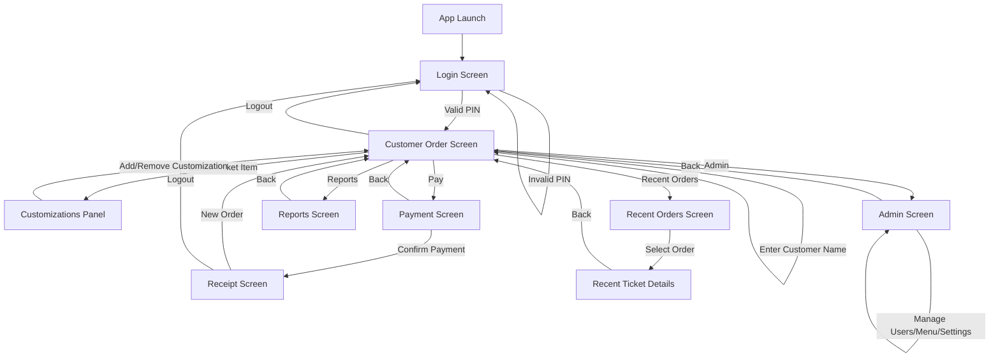

# User Flow Diagram

```mermaid
flowchart TD
    A[App Launch] --> B[Login Screen]
    B -->|Valid PIN| C[Customer Order Screen]
    B -->|Invalid PIN| B

    C -->|Add Menu Items| C
    C -->|Select Ticket Item| D[Customizations Panel]
    D -->|Add/Remove Customization| C
    C -->|Apply Discount| C
    C -->|Enter Customer Name| C
    C -->|Pay| E[Payment Screen]

    E -->|Back| C
    E -->|Confirm Payment| F[Receipt Screen]

    F -->|New Order| C
    F -->|Logout| B

    C -->|Recent Orders| G[Recent Orders Screen]
    G -->|Select Order| H[Recent Ticket Details]
    H -->|Back| C

    C -->|Reports| I[Reports Screen]
    I -->|Back| C

    C -->|Admin| J[Admin Screen]
    J -->|Manage Users/Menu/Settings| J
    J -->|Back| C

    C -->|Logout| B
```
